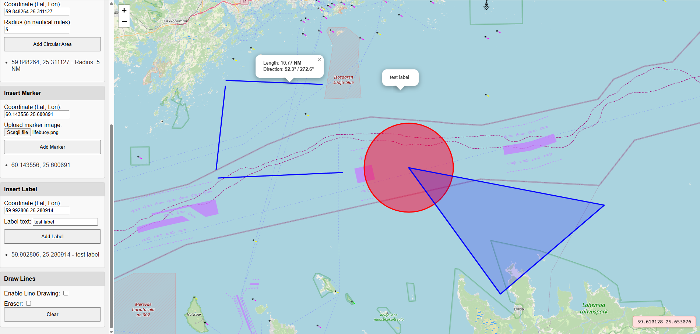

# LocalMapHtml - Maritime Analysis Tool

This project is a browser-based tool designed for maritime analysis, allowing users to interactively add, visualize, and manage various geographic features on a map. The tool is implemented as a single HTML file and is intended to be run locally in your web browser (no server required).

## Features

- **Insert Polygons**  
  Add polygons by entering a list of coordinates (one per line). Useful for defining maritime zones or areas of interest.

- **Insert Circular Area**  
  Add circular areas by specifying a center coordinate and a radius (in nautical miles). Ideal for visualizing zones such as safety perimeters or restricted areas.

- **Insert Marker**  
  Place custom markers on the map at specified coordinates. You can upload a local image to use as the marker icon.

- **Insert Label**  
  Add text labels at any coordinate on the map. Labels are shown as permanent popups without a marker icon.

- **Draw Lines**  
  Draw straight lines between points on the map. The tool displays the length (in nautical miles) and bearing for each line. An eraser mode allows you to remove lines individually.

- **Coordinate Clipboard**  
  Move your mouse over the map to see the current coordinates. Press `CTRL + L` to lock the coordinates and copy them to the clipboard.

- **Reset All**  
  Instantly remove all polygons, circles, markers, labels, and lines from the map.

- **Expandable Panels**  
  The sidebar organizes all tools into collapsible panels for a clean and user-friendly interface.

## Save Drawings to File

You can export all your map drawings—including polygons, circles, markers, labels, and lines—to a local file. This allows you to back up your work or share it with others. Simply use the "Save" button in the interface to download your current map data as a JSON file. To restore your work, use the "Load" button and select a previously saved file.

## How to Use

1. **Download or clone this repository.**
2. **Open `Map.html` in your web browser.**  
   No installation or server is required; all features work locally.

## Supported Coordinate Formats

- Decimal degrees, separated by comma or space (e.g., `44.024422, 7.514648` or `44.024422 7.514648`).

## Typical Use Cases

- Maritime area planning and analysis
- Visualizing safety or exclusion zones
- Marking points of interest with custom icons
- Annotating the map with labels
- Measuring distances and bearings between points

## Requirements

- A modern web browser (Chrome, Firefox, Edge, Safari, etc.)
- Internet connection for loading map tiles (OpenStreetMap and OpenSeaMap)

## Notes

- All data is stored in memory and will be lost when the page is refreshed.
- The tool is intended for local use and does not send any data to external servers (except for map tiles).

---

**Developed for maritime professionals, researchers, and enthusiasts needing a quick and interactive way to analyze and annotate maritime maps locally.**